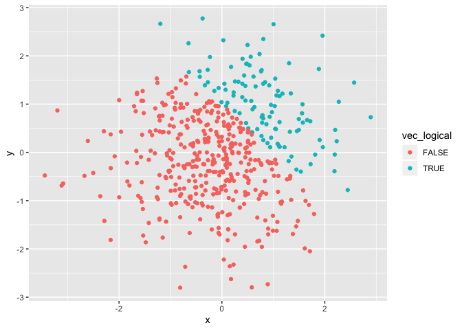
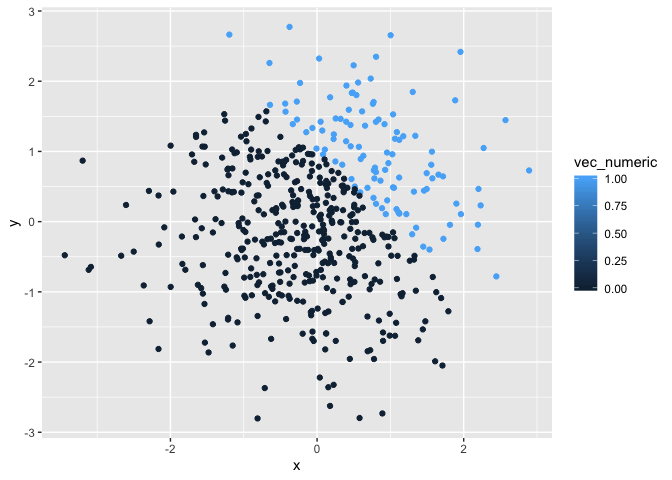
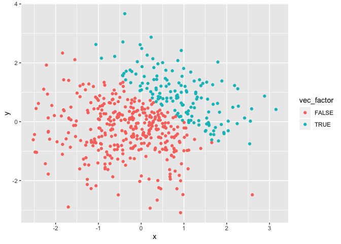

p8105\_hw1\_xh2395
================
Xin He
9/14/2019

## problem 1

``` r
library(tidyverse)
```

    ## ── Attaching packages ────────────────────────────────────────────────────────── tidyverse 1.2.1 ──

    ## ✔ ggplot2 3.2.1     ✔ purrr   0.3.2
    ## ✔ tibble  2.1.3     ✔ dplyr   0.8.3
    ## ✔ tidyr   0.8.3     ✔ stringr 1.4.0
    ## ✔ readr   1.3.1     ✔ forcats 0.4.0

    ## ── Conflicts ───────────────────────────────────────────────────────────── tidyverse_conflicts() ──
    ## ✖ dplyr::filter() masks stats::filter()
    ## ✖ dplyr::lag()    masks stats::lag()

``` r
hw1_df = tibble(
  vec_numeric = rnorm(8, mean = 0, sd = 1),
  vec_logical = vec_numeric > 0,
  vec_char = character(length = 8),
  vec_factor = factor(vec_char, levels = c("a", "b", "c"))
)

mean(pull(hw1_df, vec_numeric))
```

    ## [1] -0.1478798

``` r
mean(pull(hw1_df, vec_logical))
```

    ## [1] 0.375

``` r
mean(pull(hw1_df, vec_char))
```

    ## Warning in mean.default(pull(hw1_df, vec_char)): argument is not numeric or
    ## logical: returning NA

    ## [1] NA

``` r
mean(pull(hw1_df, vec_factor))
```

    ## Warning in mean.default(pull(hw1_df, vec_factor)): argument is not numeric
    ## or logical: returning NA

    ## [1] NA

``` r
as.numeric(pull(hw1_df, vec_logical))
```

    ## [1] 1 0 1 0 0 1 0 0

``` r
as.numeric(pull(hw1_df, vec_char))
```

    ## [1] NA NA NA NA NA NA NA NA

``` r
as.numeric(pull(hw1_df, vec_factor))
```

    ## [1] NA NA NA NA NA NA NA NA

``` r
as.numeric(pull(hw1_df, vec_logical))*pull(hw1_df, vec_numeric)
```

    ## [1] 0.1227550 0.0000000 0.1637931 0.0000000 0.0000000 0.1850498 0.0000000
    ## [8] 0.0000000

``` r
as.factor(pull(hw1_df, vec_logical))*pull(hw1_df, vec_numeric)
```

    ## Warning in Ops.factor(as.factor(pull(hw1_df, vec_logical)), pull(hw1_df, :
    ## '*' not meaningful for factors

    ## [1] NA NA NA NA NA NA NA NA

``` r
as.numeric(as.factor(pull(hw1_df, vec_logical)))*pull(hw1_df, vec_numeric)
```

    ## [1]  0.2455100 -0.4468150  0.3275862 -0.3212518 -0.5062174  0.3700996
    ## [7] -0.2284588 -0.1518936

## problem 2

``` r
problem2_df = tibble(
  x = rnorm(500, mean = 0, sd = 1),
  y = rnorm(500, mean = 0, sd = 1),
  vec_logical = x + y > 1,
  vec_numeric = as.numeric(vec_logical),
  vec_factor = as.factor(vec_logical)
)
```

The size of the dataset is 500 and 5,

The mean of x is 0.0217555,

The median of x is0.0620606,

The standard deviation of x is 1.0270935,

The proportion of cases for which x + y \> 1 is
0.294.

``` r
ggplot(problem2_df, aes(x = x, y = y, color = vec_logical)) + geom_point()
```

<!-- -->

``` r
ggsave("firstplot.png")
```

    ## Saving 7 x 5 in image

``` r
ggplot(problem2_df, aes(x = x, y = y, color = vec_numeric)) + geom_point()
```

<!-- -->

``` r
ggplot(problem2_df, aes(x = x, y = y, color = vec_factor)) + geom_point()
```

<!-- -->
