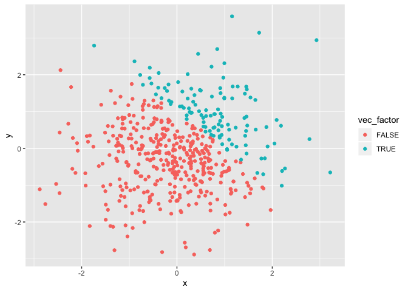

p8105\_hw1\_xh2395
================
Xin He
9/14/2019

## problem 1

**Create a data frame as
    required:**

``` r
library(tidyverse)
```

    ## ── Attaching packages ────────────────────────────────────────────────────────── tidyverse 1.2.1 ──

    ## ✔ ggplot2 3.2.1     ✔ purrr   0.3.2
    ## ✔ tibble  2.1.3     ✔ dplyr   0.8.3
    ## ✔ tidyr   0.8.3     ✔ stringr 1.4.0
    ## ✔ readr   1.3.1     ✔ forcats 0.4.0

    ## ── Conflicts ───────────────────────────────────────────────────────────── tidyverse_conflicts() ──
    ## ✖ dplyr::filter() masks stats::filter()
    ## ✖ dplyr::lag()    masks stats::lag()

``` r
problem1_df = tibble(
  vec_numeric = rnorm(8, mean = 0, sd = 1),
  vec_logical = vec_numeric > 0,
  vec_char = character(length = 8),
  vec_factor = factor(vec_char, levels = c("a", "b", "c"))
)
```

**Take the mean of each variable in the data
    frame:**

``` r
mean(pull(problem1_df, vec_numeric))
```

    ## [1] 0.1755581

``` r
mean(pull(problem1_df, vec_logical))
```

    ## [1] 0.625

``` r
mean(pull(problem1_df, vec_char))
```

    ## Warning in mean.default(pull(problem1_df, vec_char)): argument is not
    ## numeric or logical: returning NA

    ## [1] NA

``` r
mean(pull(problem1_df, vec_factor))
```

    ## Warning in mean.default(pull(problem1_df, vec_factor)): argument is not
    ## numeric or logical: returning NA

    ## [1] NA

The mean of vec\_numeric and vec\_logical works. However, the mean of
vec\_char and vec\_factor doesn’t work.

**Convert variables from one type to another:**

``` r
as.numeric(pull(problem1_df, vec_logical))
```

    ## [1] 0 0 1 1 1 1 0 1

``` r
as.numeric(pull(problem1_df, vec_char))
```

    ## [1] NA NA NA NA NA NA NA NA

``` r
as.numeric(pull(problem1_df, vec_factor))
```

    ## [1] NA NA NA NA NA NA NA NA

After convert the logical, character, and factor variables to numeric
variables, the logical variable shows as 0 or 1, the character variable
shows as NA, the factor variable also shows as NA. This helps explain
why the mean of vec\_numeric and vec\_logical works but the mean of
vec\_char and vec\_factor doesn’t work.

**Convert and
multiply:**

``` r
as.numeric(pull(problem1_df, vec_logical))*pull(problem1_df, vec_numeric)
```

    ## [1] 0.0000000 0.0000000 1.2415849 0.5166485 1.1708866 0.0345899 0.0000000
    ## [8] 0.9446244

``` r
as.factor(pull(problem1_df, vec_logical))*pull(problem1_df, vec_numeric)
```

    ## Warning in Ops.factor(as.factor(pull(problem1_df, vec_logical)),
    ## pull(problem1_df, : '*' not meaningful for factors

    ## [1] NA NA NA NA NA NA NA NA

``` r
as.numeric(as.factor(pull(problem1_df, vec_logical)))*pull(problem1_df, vec_numeric)
```

    ## [1] -0.35908965 -1.78868250  2.48316986  1.03329695  2.34177318  0.06917981
    ## [7] -0.35609726  1.88924889

## problem 2

**Create a data frame as required:**

``` r
problem2_df = tibble(
  x = rnorm(500, mean = 0, sd = 1),
  y = rnorm(500, mean = 0, sd = 1),
  vec_logical = x + y > 1,
  vec_numeric = as.numeric(vec_logical),
  vec_factor = as.factor(vec_logical)
)
```

The size of the dataset is 500 and 5.

The mean of x is 0.0162651.

The median of x is0.0272318.

The standard deviation of x is 1.0039827.

The proportion of cases for which x + y \> 1 is 0.226.

**Make a scatterplot of y vs x (color points using the logical
variable):**

``` r
ggplot(problem2_df, aes(x = x, y = y, color = vec_logical)) + geom_point()
```

<!-- -->

**Export the first scatterplot to the project directory:**

``` r
ggsave("firstplot.png")
```

    ## Saving 7 x 5 in image

**Make a second scatterplot of y vs x (color points using the numeric
variable):**

``` r
ggplot(problem2_df, aes(x = x, y = y, color = vec_numeric)) + geom_point()
```

<!-- -->

**Make a third scatterplot of y vs x (color points using the factor
variable):**

``` r
ggplot(problem2_df, aes(x = x, y = y, color = vec_factor)) + geom_point()
```

<!-- -->
